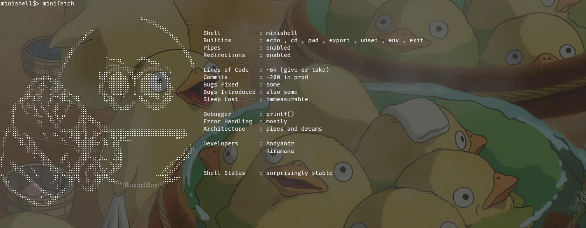

# Minishell

A simplified Unix shell implemented in C, built as a project at 42 Antananarivo. The goal is to recreate a minimal but functional version of **bash**, handling user input, executing commands, and managing processes — all from scratch (on top of a custom `libft`).

## Screenshots



## Description

**minishell** is an interactive command-line interpreter that replicates core behaviors of bash. It reads user input via `readline`, parses and expands it, then executes the resulting commands — whether they are built-in or external programs found in `$PATH`.

### Supported features

| Feature | Details |
|---|---|
| **Prompt** | Displays `minishell$>` and waits for user input |
| **Command execution** | Runs any external program available in `$PATH` |
| **Pipelines** | Chain commands with `\|` (e.g. `ls \| grep .c \| wc -l`) |
| **Redirections** | Output: `>` (truncate), `>>` (append) — Input: `<` |
| **Here-document** | `<< DELIMITER` for inline input until the delimiter is matched |
| **Environment variables** | Expansion of `$VAR` and `$?` (last exit status) |
| **Quoting** | Single quotes preserve literal value; double quotes allow `$` expansion |
| **Signal handling** | `Ctrl-C` (new prompt), `Ctrl-D` (exit), `Ctrl-\` (ignored) |

### Built-in commands

| Command | Description |
|---|---|
| `echo` | Print text to stdout (supports `-n` flag) |
| `cd` | Change the current working directory |
| `pwd` | Print the current working directory |
| `export` | Set or display environment variables |
| `unset` | Remove environment variables |
| `env` | Display the current environment |
| `exit` | Exit the shell with an optional exit code |
| `minifetch` | Easter egg — displays a stylized system info card |

## Instructions

### Prerequisites

- A Unix-like operating system (Linux / macOS)
- `cc` (or any C compiler)
- `make`
- The **readline** library (`libreadline-dev` on Debian/Ubuntu, `readline` on macOS via Homebrew)

### Compilation

Clone the repository and build with `make`:

```bash
git clone <repository-url> minishell
cd minishell
make
```

Available Makefile targets:

| Target | Description |
|---|---|
| `make` | Compile the project (and `libft`) |
| `make clean` | Remove object files |
| `make fclean` | Remove object files and the binary |
| `make re` | Full recompile from scratch |

### Running

```bash
./minishell
```

The shell accepts no arguments. Once launched, type commands at the `minishell$>` prompt just as you would in bash !

### Usage examples

```
minishell$> echo "Hello, world!"
Hello, world!

minishell$> ls -la | grep Makefile
-rw-r--r-- 1 user user 1234 Jan 10 15:20 Makefile

minishell$> cat << EOF
> line one
> line two
> EOF
line one
line two

minishell$> export NAME=minishell && echo $NAME
minishell

minishell$> exit
```

## Authors

- **riramana** 
- **andyandr** 
